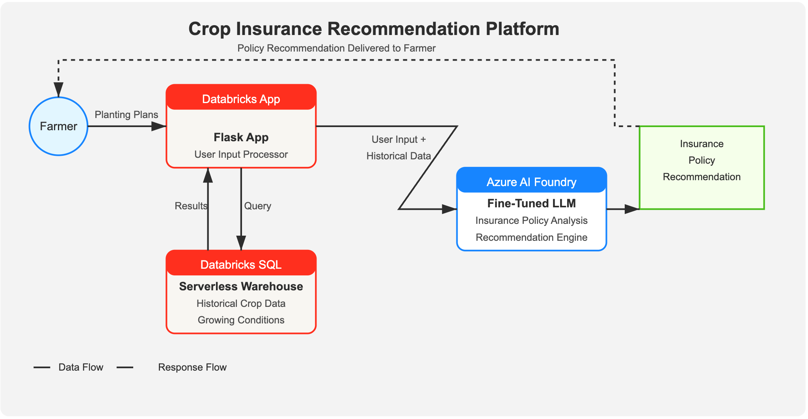

# AgriCover

AgriCover is an intelligent crop insurance recommendation system designed to help farmers in Illinois make informed decisions about their insurance coverage based on various agricultural factors and risk assessments.

## Overview

AgriCover uses advanced data analytics and machine learning to provide personalized crop insurance recommendations. The system takes into account multiple factors such as crop type, location, field characteristics, farming practices, and historical yield data to assess risk and suggest optimal insurance coverage options.

## Features

- **Personalized Risk Assessment**: Evaluates risk based on crop type, county, planting date, drainage conditions, tillage practices, and more
- **Coverage Recommendations**: Suggests optimal insurance coverage levels based on individual farm characteristics
- **Premium Calculations**: Provides accurate premium estimates for different coverage levels
- **Data-Driven Insights**: Leverages historical yield data from Illinois counties to inform recommendations
- **User-Friendly Interface**: Simple web form for inputting farm details and viewing recommendations

## Technology Stack

- **Backend**: Flask (Python)
- **Database**: Databricks SQL
- **AI/ML**: Azure OpenAI for intelligent recommendations
- **Frontend**: HTML, CSS, JavaScript
- **Environment Management**: dotenv for configuration



## Setup and Installation

### Prerequisites

- Python 3.8+
- Databricks workspace
- Azure OpenAI access

### Environment Variables

Create a `.env` file in the root directory with the following variables:

```
DATABRICKS_HOST=your_databricks_host
DATABRICKS_WAREHOUSE_ID=your_warehouse_id
DATABRICKS_PAT=your_personal_access_token
AZURE_OPENAI_ENDPOINT_KEY=your_azure_openai_key
AZURE_OPENAI_ENDPOINT=your_azure_openai_endpoint
```

### Installation

1. Clone the repository:
   ```
   git clone https://github.com/yourusername/agricover.git
   cd agricover
   ```

2. Create and activate a virtual environment:
   ```
   python -m venv venv
   source venv/bin/activate  # On Windows: venv\Scripts\activate
   ```

3. Install dependencies:
   ```
   pip install -r requirements.txt
   ```

4. Run the application:
   ```
   python app.py
   ```

5. Access the application at `http://localhost:5000`

## Usage

1. Fill out the form with your farm details:
   - Crop type (corn or soybean)
   - County location
   - Field size
   - Planting date
   - Drainage conditions
   - Tillage practices
   - Nitrogen application rate
   - Previous crop
   - Desired coverage level
   - Unit structure

2. Submit the form to receive personalized insurance recommendations

3. Review the risk assessment, recommended coverage options, and premium estimates

## Project Structure

```
agricover/
├── app.py                  # Main Flask application
├── templates/              # HTML templates
│   └── index.html          # Main form and results page
├── tools/                  # Utility modules
│   ├── dbsql.py            # Databricks SQL connection utilities
│   └── azureOpenAI.py      # Azure OpenAI integration
├── data/                   # Data files
│   └── policies.json       # Insurance policy definitions
├── .env                    # Environment variables (not in repo)
└── README.md               # Project documentation
```

## Data Sources

The application uses historical yield data for Illinois counties stored in a Databricks SQL table. This data helps inform the risk assessment and premium calculations based on regional trends and patterns.

## Future Enhancements

- Integration with weather data APIs for more accurate risk assessment
- Mobile application for on-the-go access
- Additional crop types beyond corn and soybeans
- Integration with farm management software
- Expanded coverage for more states beyond Illinois

## License

[MIT License](LICENSE)